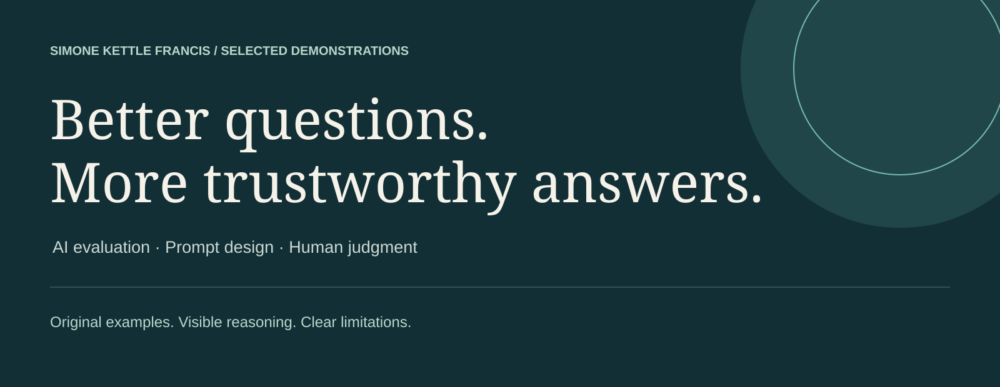

# AI Evaluation Portfolio

**Simone Kettle Francis · AI evaluation · Prompt design · Human judgment**

A visual collection of original demonstrations: how to inspect an answer, explain a rating, refine a prompt, and recognize what the evidence does not support.

**[Explore the visual portfolio ↗](https://simonekettlefrancis.github.io/ai-evaluation-portfolio/)** · [How to add a study](MAINTAINING.md) · [Case-study template](templates/case-study.md)

> **About these examples:** Every featured case study uses synthetic scenarios, authored responses, original visuals, and fictional data. They demonstrate evaluation methods; they are not client deliverables, employer training materials, production outputs, or measured model-performance claims.

## Selected demonstrations

<table><tr>
<td width="50%" valign="top"><h3>01 · Prompt refinement</h3>
Turn an open-ended request into a testable set of instructions, then check the answer against each constraint.
<a href="docs/studies/prompt-refinement.md">Read the demonstration →</a></td>
<td width="50%" valign="top"><h3>02 · Response evaluation</h3>
Use a small, original rubric to distinguish factual support, instruction following, and clarity.
<a href="docs/studies/response-evaluation.md">Read the demonstration →</a></td>
</tr></table>

<table><tr>
<td width="50%" valign="top"><h3>03 · Failure analysis</h3>
Separate an unsupported inference from a formatting error, then define a focused regression check.
<a href="docs/studies/failure-analysis.md">Read the demonstration →</a></td>
<td width="50%" valign="top"><h3>04 · Tool-use evaluation</h3>
Evaluate a fictional travel search against budget, timing, and explicit missing information.
<a href="docs/studies/tool-use.md">Read the demonstration →</a></td>
</tr></table>

<table><tr>
<td width="50%" valign="top"><h3>05 · Image understanding</h3>
Use an original chart to separate correct extraction from an unsupported causal explanation.
<a href="docs/studies/image-understanding.md">Read the demonstration →</a></td>
<td width="50%" valign="top"><h3>06 · Preference ranking</h3>
Compare two replies using earlier constraints and write a concise, evidence-based preference justification.
<a href="docs/studies/preference-ranking.md">Read the demonstration →</a></td>
</tr></table>

<table><tr>
<td valign="top"><h3>07 · Business-artifact review</h3>
Review presentation storytelling, report evidence, and operational handoffs as one connected business narrative.
<a href="docs/studies/business-artifact-review.md">Read the demonstration →</a></td>
</tr></table>

## What connects the work

- **Evidence before confidence:** distinguish supported facts from plausible invention.
- **Clear evaluation:** tie judgments to explicit constraints and specific observations.
- **Useful feedback:** show what failed, why it matters, and what to test next.
- **Honest scope:** identify synthetic content and avoid presenting illustrative scores as production results.

## A portfolio that grows

The case studies live in [`docs/studies/`](docs/studies/). Copy the [template](templates/case-study.md), write a new example, and save it in that folder. GitHub Pages adds it to the visual gallery after the site rebuilds. The repository gallery above can be updated separately when you want to feature a new study.

You can make these edits in GitHub's browser editor. No local development setup is needed for routine updates. See the [illustrated structure and updating guide](MAINTAINING.md).

## Repository map

| Location | Purpose |
| --- | --- |
| `docs/studies/` | Editable case-study text |
| `docs/assets/` | Original SVG visuals and site styling |
| `docs/index.html` | Automatically populated website gallery |
| `templates/case-study.md` | Reusable starting point |
| `MAINTAINING.md` | Add, update, and publish instructions |

No private repository history, screenshots, internal URLs, or employer rubrics are included.
