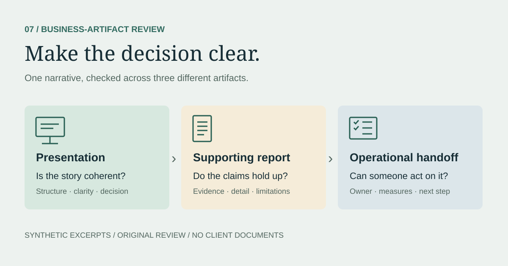

> **Synthetic demonstration.** This example illustrates the business-artifact review work described by Simone Kettle Francis. The excerpts, organization, figures, and feedback below were created for this portfolio. No original project files, client documents, employer criteria, or confidential results are reproduced.

## My work

I reviewed business artifacts, including presentations, reports, and operational support materials, for storytelling, clarity, detail, and practical usefulness.

## Judgment involved

I considered whether the narrative was clear, whether the supporting detail justified the claims, and whether the document helped its audience understand what to do next.

## Synthetic example

The scenario and decisions below were created for this portfolio; they are not a record of a client assignment.

## The question

Do the presentation, supporting report, and operational notes tell a consistent story that helps a reader make a decision and act on it?

## Review scope

This demonstration examines three short, fictional excerpts from a business review packet for **Harbor Desk**, an invented support team:

- **Presentation excerpt:** the story a decision-maker sees first.
- **Report excerpt:** the details that should support the story.
- **Operations handoff:** the instructions that should make the decision actionable.

These are text excerpts representing those artifact types, not a review of an actual PowerPoint or client report. A full file review would also check slide order, visual hierarchy, chart labels, page layout, and readability in the rendered document.

## The fictional artifacts

### 1. Presentation excerpt

> **Slide title:** Automation transformed support performance.
>
> Tickets closed increased from 80 to 96. Efficiency improved by 20%. Roll out the workflow to every queue immediately.

The headline sounds decisive, but it does not name the comparison period, define efficiency, or explain the basis for an immediate rollout.

### 2. Supporting report excerpt

| Measure | Week 1 | Week 2 |
| --- | --- | --- |
| Tickets closed | 80 | 96 |
| Staff hours | 40 | 48 |
| Tickets closed per staff hour | 2.0 | 2.0 |
| Reopened tickets | Not recorded | Not recorded |

The team introduced a response template in Week 2. Staffing hours also increased. The report covers one queue over two weeks and contains no control group, case-complexity measure, or customer-quality assessment.

### 3. Operations handoff excerpt

> Deploy the template next week. The team will monitor performance and raise issues as needed.

The handoff does not identify an owner, define what to monitor, set a review date, or explain how to respond to a problem.

## Findings and revision priorities

| Review lens | Finding | Suggested revision |
| --- | --- | --- |
| Storytelling | The deck jumps from an activity change to a broad success claim. | Use a sequence of observation, evidence, limitation, and decision request. |
| Numerical accuracy | Ticket volume increased by 20%, but staff hours also increased by 20%. | Say throughput increased; do not describe unchanged tickets per hour as an efficiency gain. |
| Evidence strength | The template's causal contribution is unknown. | Distinguish the observed change from possible explanations. |
| Cross-document consistency | The deck's “efficiency” claim conflicts with the report's per-hour figures. | Use the same metric definitions and period labels across artifacts. |
| Clarity and detail | The report omits quality measures and scope limitations from the summary. | Put scope, missing measures, and limitations beside the headline result. |
| Operational usefulness | “The team” and “as needed” leave accountability unclear. | Name a responsible role, review cadence, and escalation path. |

## Revised presentation story

1. **Observation:** Weekly closures rose from 80 to 96 while staff hours rose from 40 to 48.
2. **Interpretation:** Tickets closed per staff hour stayed at 2.0; an efficiency improvement has not been established.
3. **Limitation:** Two weeks in one queue cannot isolate the template's effect, and service-quality data is missing.
4. **Decision request:** Approve a limited follow-up pilot with consistent reporting before considering wider use.

### Revised executive summary

> Harbor Desk closed 20% more tickets in Week 2, with 20% more staff hours. Productivity measured as tickets closed per staff hour remained unchanged at 2.0. The available evidence does not establish whether the new template improved efficiency or service quality. A limited follow-up pilot should collect comparable workload and quality data before any broader rollout decision.

## Revised operational handoff

The following is a proposed fictional plan, not a report of work already completed.

| Element | Proposed handoff detail |
| --- | --- |
| Scope | Continue the template in the same pilot queue for two more weeks. |
| Accountable role | Support operations lead owns the pilot and the follow-up decision memo. |
| Tracking | Record tickets closed, staff hours, reopen counts, and case complexity each week; define measures before the pilot starts. |
| Quality review | A designated reviewer examines a consistent sample of replies each week using documented criteria. |
| Escalation | Staff flag misleading or incorrect template replies to the operations lead for review and correction before further use. |
| Decision checkpoint | At the end of Week 4, compare workload, productivity, and quality findings; document whether to revise, extend, or stop the pilot. |

## What this demonstrates

Business-artifact review combines editorial judgment with evidence checking. A useful review checks whether the story is understandable, the details support the claims, the artifacts agree with one another, and the proposed next step is operationally clear.

The numerical checks here are limited to the fictional values shown: `(96 − 80) / 80 = 20%`, `(48 − 40) / 40 = 20%`, and `80 / 40 = 96 / 48 = 2.0`. No real business improvement, client outcome, or completed project result is claimed.

## Next test

Review a complete synthetic slide deck and report together. Check whether headings make sense when read in sequence, charts state units and periods, caveats remain visible, and the final decision request matches the operational handoff.
