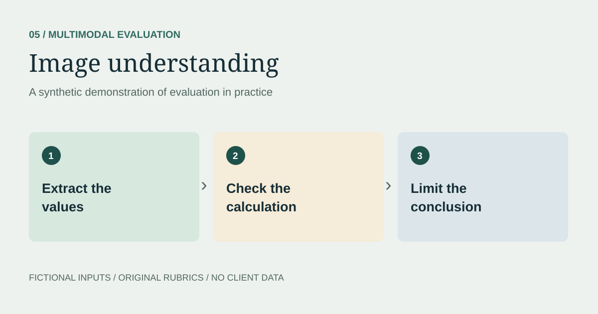
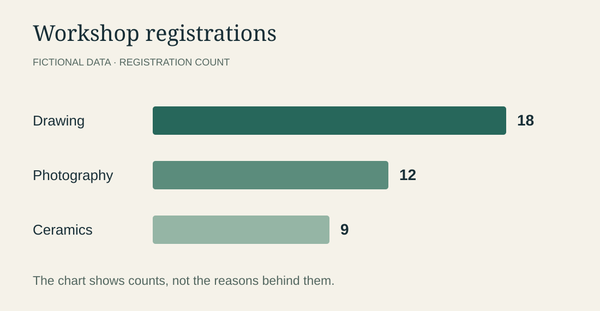

> **Synthetic demonstration.** All scenarios, model responses, data, and evaluation decisions on this page are illustrative. No client material or production results are reproduced.

## The question
Can an assistant read a chart accurately without claiming more than the image shows?

## Original synthetic visual

The chart and its values were created specifically for this demonstration. They do not describe an actual organization, audience, or outcome.

## Prompt
> Which workshop has the most registrations, and how many more does it have than the least popular workshop? Can we tell why it is more popular?

### Illustrative answer with an error
> Drawing has 18 registrations, which is 9 more than Ceramics. Drawing is more popular because it is cheaper and easier for beginners.

## Evaluation
| Claim | Assessment | Reason |
| --- | --- | --- |
| Drawing has the most registrations | Supported | The chart shows 18, the highest value. |
| The difference is 9 | Supported | 18 minus 9 equals 9. |
| Lower price explains the difference | Unsupported | No prices appear in the chart. |
| Beginner accessibility explains it | Unsupported | The chart contains no experience-level data. |

## Revised answer
> Drawing has the most registrations, with 18—9 more than Ceramics, which has 9. The chart does not explain the difference; we would need additional information to identify a reason.

## What this demonstrates
Visual extraction, arithmetic, and interpretation are separate checks. A response can read every number correctly while still inventing a causal explanation.

## Next test
Use a low-resolution chart, remove a label, or change the scale. A reliable answer should express uncertainty when the image is not legible rather than guessing a value.
