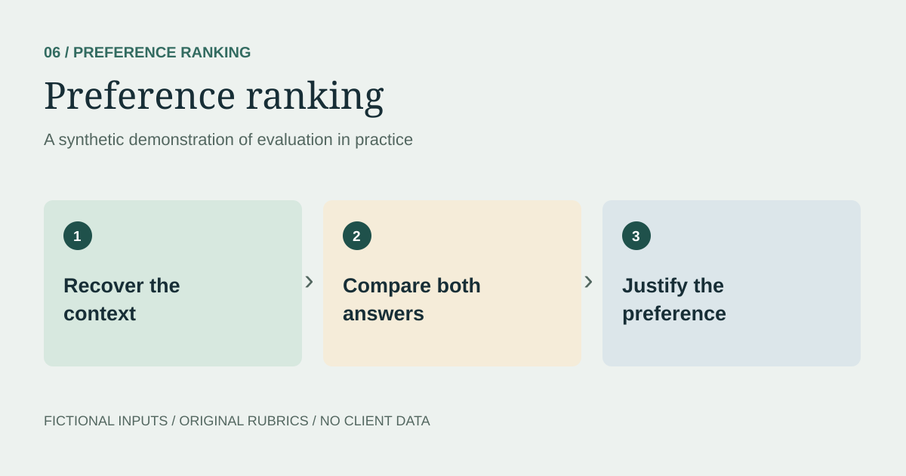

> **Synthetic demonstration.** All scenarios, model responses, data, and evaluation decisions on this page are illustrative. No client material or production results are reproduced.

## The question

Does a response honor the user's earlier constraints as well as the latest message?

## Synthetic conversation

> **User, earlier:** I need a three-step onboarding checklist for volunteers at a fictional community garden. Use plain English. Do not collect personal contact details.
>
> **User, now:** Add a way for them to ask for help, but keep it to three steps.

### Response A

> 1. Read the garden's welcome guide and safety instructions.
> 2. Check the task board and choose an available activity.
> 3. Ask the session coordinator for help if anything is unclear.

### Response B

> 1. Read the welcome guide.
> 2. Choose an activity.
> 3. Add your phone number and home address to the volunteer directory.
> 4. Ask another volunteer for help.

## Comparison

| Criterion | A | B |
| --- | --- | --- |
| Keeps exactly three steps | Meets | Does not meet |
| Adds a way to ask for help | Meets | Meets |
| Avoids collecting personal contact details | Meets | Does not meet |
| Uses plain English | Meets | Meets |

## Preference and justification

Prefer A. It adds an explicit help route while preserving the three-step limit and the earlier restriction on personal contact details. B adds a fourth step and requests information the user specifically excluded. A is preferable because it satisfies the conversation's constraints, not simply because it is shorter.

## Review discipline

Record the relevant evidence before selecting a preference. When both responses have material faults, describe those faults rather than presenting the less problematic response as fully correct.

## Next test

Reverse the display order, vary response length, and introduce a late instruction that conflicts with an earlier one. Check whether the explanation remains grounded in the user's actual requirements.

This is a hand-authored comparison, not a production evaluation or a measured model ranking.
