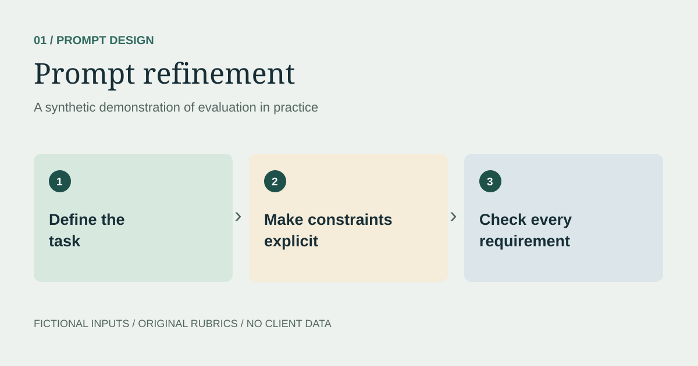

## My role

My work involved reviewing instructions and model outputs, identifying where an answer missed the task, and refining wording or correcting the response. The review included factual support, tone, formatting, and overall quality—not just writing a more detailed prompt.

### What the task involved

- Read the task and supplied requirements before judging the output.
- Check the response for unsupported claims, missed constraints, tone, and formatting problems.
- Refine the prompt when clarification was needed, or improve the response when the answer itself needed correction.
- Explain the changes in terms of the task and the observed defects.

The contribution was human review and refinement. Prompt revision and response correction are related activities, but they are not the same deliverable.

## Independent example of the task

> **Real work context; synthetic demonstration.** The role description summarizes my evaluation work. The brief, responses, visuals, and judgments below were independently created to illustrate this type of task. They are not original assignments, client materials, proprietary criteria, or measured production results.

## The question

How can a prompt make the desired answer easier to produce and easier to assess?

This synthetic demonstration uses a fictional community workshop. The aim is to write a useful invitation without inventing details.

## Task brief

Write an invitation for a free beginner sketching workshop at the fictional Harbor Studio. It runs Saturday, October 10, 2026, from 2–3 p.m. Materials are provided. The audience is adults with no drawing experience. Registration details have not been supplied.

### Initial prompt

> Write a fun invitation for our sketching workshop.

### Illustrative weak response

> Join our award-winning instructors this Sunday for an unforgettable workshop! Reserve your seat at harborstudio.example. Bring your own pencils and sketchbook.

The response invents instructor credentials and a registration route, uses the wrong day, and contradicts the materials policy. These are constructed failure examples, not outputs recorded from a production model.

## Refined prompt

> Using only the supplied task brief, write a warm invitation for adults with no drawing experience. Use a title and one paragraph. Include the date, time, free admission, and provided materials. Keep the entire invitation under 70 words. Do not invent credentials, availability, addresses, or registration instructions. If registration information is missing, omit it.

## Illustrative revised response

> **Try sketching at Harbor Studio**
>
> Curious about drawing? Join a free beginner sketching workshop at Harbor Studio on Saturday, October 10, 2026, from 2–3 p.m. No experience is needed, and materials are provided. Come explore a new skill in a relaxed session for adults.

## Review and correction record

The initial answer needs factual correction regardless of whether the prompt is rewritten. I would remove the invented credentials and registration route, restore the supplied day and materials policy, and preserve a welcoming tone. The revised answer below is an authored correction; it is not proof that changing a prompt caused a model to improve. The title, paragraph, and word-limit checks apply to the refined prompt.

| Check | Initial response | Revised response |
| --- | --- | --- |
| Date and time match the brief | Fail | Pass |
| Free admission and provided materials stated | Fail | Pass |
| No invented claims or registration route | Fail | Pass |
| Title and one paragraph | Fail | Pass |
| Under 70 words | Pass | Pass |

## What this demonstrates

Separating facts, constraints, and style makes evaluation repeatable. The revised example passes the five checks in this deliberately small exercise. This is not evidence of a measured improvement across a model or a dataset.

## Next test

Try missing dates, contradictory briefs, and requests for unsupported urgency. Record whether the response asks for clarification or invents missing facts.
