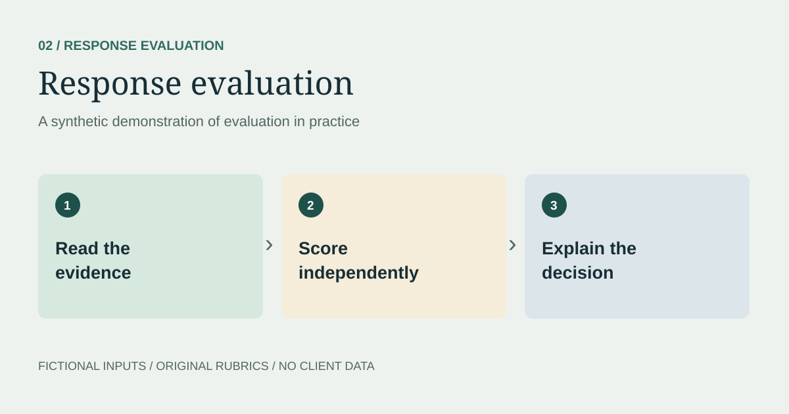

> **Synthetic demonstration.** All scenarios, model responses, data, and evaluation decisions on this page are illustrative. No client material or production results are reproduced.

## The question
How can two plausible answers receive a clear, evidence-based evaluation?

## Synthetic source and task
The fictional Cedar Library is open Monday–Friday, 9 a.m.–6 p.m., and Saturday, 10 a.m.–2 p.m. It is closed Sunday. Library cards are free for residents. The source says nothing about parking or late fees.

> Summarize the weekend hours and card cost in two bullets. Use only the source.

### Response A
> - The library is open Saturday, 10 a.m.–2 p.m., and closed Sunday.
> - Library cards are free for residents.

### Response B
> - The library is open all weekend, 10 a.m.–2 p.m.
> - Cards are free for everyone, with free parking and no late fees.

## Original demonstration rubric
Each dimension is scored separately. These anchors were created for this portfolio; they are not an employer's rubric.

| Dimension | 0 — Does not meet | 1 — Partly meets | 2 — Meets |
| --- | --- | --- | --- |
| Factual support | Contradicts the source | Omits an important qualifier | Every claim is supported |
| Instruction following | Misses the requested task | Partly follows the format or scope | Follows task, format, and scope |
| Clarity | Hard to understand | Understandable but ambiguous | Clear and concise |

## Evaluation record
| Dimension | A | B | Evidence |
| --- | --- | --- | --- |
| Factual support | 2 | 0 | B invents Sunday opening and unsupported benefits. |
| Instruction following | 2 | 1 | B uses two bullets but violates the source-only constraint. |
| Clarity | 2 | 2 | Both are readable; readability does not establish correctness. |

## Decision and feedback
Prefer A. It preserves the resident eligibility condition and the Sunday closure. B needs correction of its hours and removal of unsupported card eligibility, parking, and fee claims.

The scores describe these two constructed answers only. They are not benchmark results, client ratings, or production performance metrics.

## Next test
Have a second reviewer apply the rubric independently. Resolve disagreements by citing the source, then revise ambiguous rubric language before evaluating more examples.
