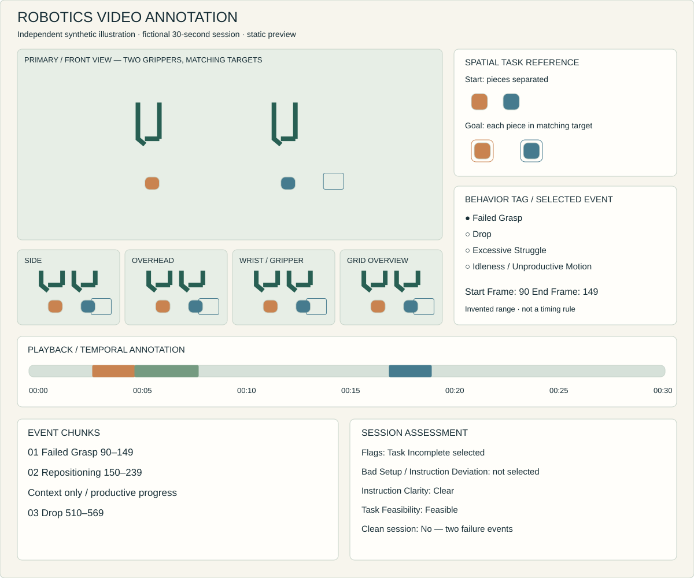

## My work

I reviewed short robot-manipulation sessions in a multi-camera video annotation workspace. I compared observed behavior with task instructions, setup requirements, and spatial scene references; navigated recordings at frame level; selected precise event ranges; and applied behavior tags including Drop, Failed Grasp, Excessive Struggle, and Idleness / Unproductive Motion.

The work also involved session-level assessment of setup quality, instruction adherence, task completion, instruction clarity, and task feasibility. Ambiguous cases required comparing camera views and distinguishing repeated failure from productive progress, repositioning, or a new behavioral event.

This is hands-on human-in-the-loop annotation and physical-agent evaluation experience, not robotics engineering, programming, or model development.

## Judgment involved

The decision was more than selecting a label. I needed to establish whether object control had occurred, whether a movement advanced the task, where an event began and ended, and whether a concern belonged to one interval or the session as a whole.

## How the Evaluation Worked

1. **Understand the task.** Review written instructions, the expected result, setup information, and a spatial task reference or hologram-style scene map.
2. **Review the evidence.** Play, pause, and compare side, front, overhead, wrist/gripper, and grid views to understand motion and object interaction.
3. **Locate the event.** Use frame-level navigation to identify the beginning and end of the behavior.
4. **Tag the event range.** Record the Start Frame and End Frame and assign a Behavior Tag to that Event Range. Review the tagged event chunks together.
5. **Assess the full session.** Add Session Tags as appropriate, assess Instruction Clarity and Task Feasibility, or mark the session clean when no relevant bad behavior was observed.

Temporal precision mattered: the range needed to capture the complete behavioral event within the project’s permitted timing tolerance. Original buffer rules and numerical thresholds are not reproduced here.

## Synthetic annotation workspace

> **Synthetic portfolio demonstration created independently. It represents the evaluation workflow and skills involved; no client footage, proprietary interface, confidential instructions, or project data is included.**

This static illustration represents a fictional 30-second session, not playable footage or a reproduction of the application I used. Two generic grippers move colored geometric objects toward matching target areas. The spatial task reference shows the starting arrangement and intended outcome.

### Fictional event sequence

Approach → Failed Grasp → Reposition → Successful Grasp → Placement Attempt → Drop.

For this example only, the timeline assumes 30 frames per second and zero-based frame indices 0–899. The ranges below are invented annotations, not project thresholds.

| Event chunk | Start Frame | End Frame | Decision |
| --- | --- | --- | --- |
| Failed Grasp | 90 | 149 | Contact occurs without stable object control. |
| Productive Repositioning | 150 | 239 | Changes the pickup angle; shown as context, not a failure tag. |
| Drop | 510 | 569 | Established control is lost during placement. |

### Evaluator reasoning

The initial contact did not establish control, supporting Failed Grasp. The following motion changed the pickup angle and advanced the task, so it was treated as Productive Progress through Repositioning rather than continued Excessive Struggle. The subsequent pickup was reviewed as a new attempt, rather than automatically grouped as a Repeated Attempt within the previous event.

A single camera can make these movements look similar. Comparing overhead and gripper views helps determine whether control was established before assigning Drop or Failed Grasp. When the evidence is insufficient, the uncertainty should remain explicit instead of forcing a confident label.

## Behavior-Level Tags

These are original plain-language explanations for this portfolio, not a client rubric.

| Behavior Tag | What the evaluator distinguishes |
| --- | --- |
| Failed Grasp | A pickup is attempted without establishing stable control. |
| Drop | Control was established, then support or control was unintentionally lost. |
| Excessive Struggle | Repeated unsuccessful attempts do not show sufficient productive progress under the applicable criteria. |
| Idleness / Unproductive Motion | Inactivity or movement does not meaningfully advance the task under the applicable criteria. |

**Operational definitions—not ordinary-language impressions—determine the final classification.** Productive Progress, Repositioning, and Repeated Attempt help explain the reasoning; movement alone is not proof of a failure.

## Session-level assessment

Event tags describe behavior within a particular interval. Session tags describe conditions or outcomes affecting the recording or task as a whole.

| Assessment | Available illustrative choices | Fictional selection and reason |
| --- | --- | --- |
| Session Flags | Bad Setup; Instruction Deviation; Task Incomplete | Task Incomplete: one object remains outside its target at the end. |
| Instruction Clarity | Clear; Unclear; Very Unclear | Clear: objects and matching targets are specified. |
| Task Feasibility | Feasible; Difficult; Impossible | Feasible: the illustrated setup provides accessible objects and targets. |
| Clean session | No relevant bad behavior observed | Not selected: the example contains Failed Grasp and Drop. |

The visible outcome alone does not establish Bad Setup or Instruction Deviation. Those flags require evidence tied to the setup and task instructions.

## Skills represented

Human-in-the-loop AI; robot-behavior video annotation; physical-agent evaluation; frame-level Temporal Annotation; visual and spatial reasoning; rubric-based classification; session-level quality assessment; and Edge Case analysis.
